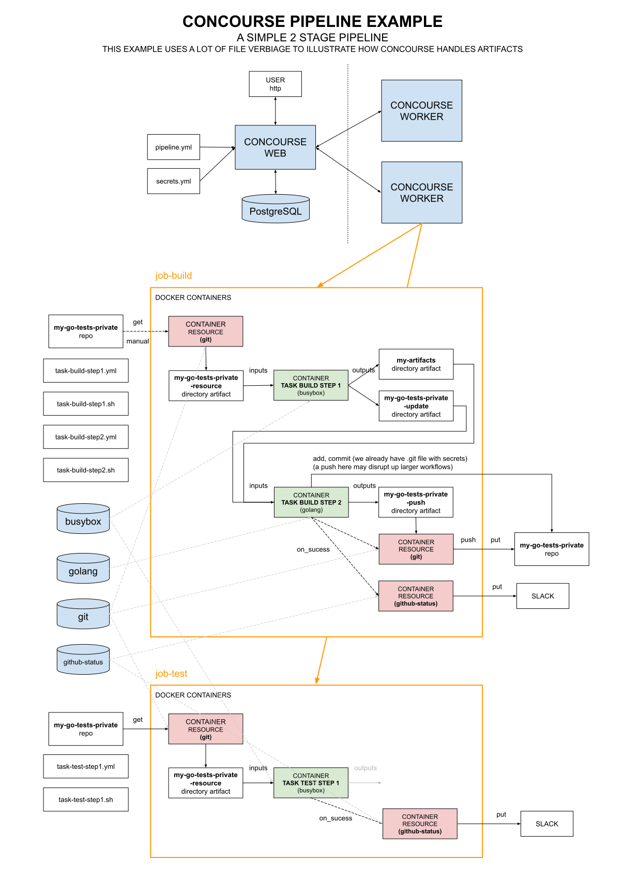

# CONCOURSE PIPELINE EXAMPLE

[](https://jeffdecola.mit-license.org)
[](https://jeffdecola.com)

  _A concourse pipeline example that show task steps and how
  concourse handles artifacts. It uses a github repo and separates
  the task steps and script files.
  This should be your goto example to understand concourse._

Table of Contents

* [OVERVIEW](https://github.com/JeffDeCola/my-cicd-pipeline-examples/concourse-pipelines/concourse-pipeline-example#overview)
* [PIPELINE](https://github.com/JeffDeCola/my-cicd-pipeline-examples/concourse-pipelines/concourse-pipeline-example#pipeline)
* [JOB BUILD](https://github.com/JeffDeCola/my-cicd-pipeline-examples/concourse-pipelines/concourse-pipeline-example#job-build)
* [JOB TEST](https://github.com/JeffDeCola/my-cicd-pipeline-examples/concourse-pipelines/concourse-pipeline-example#job-test)

## OVERVIEW

This pipeline outlines the feature of the concourse ci system.



## PIPELINE

To add the pipeline to concourse I used,

```bash
fly --target jeffs-ci-target \
    set-pipeline \
    --pipeline concourse-pipeline-example \
    --config pipeline.yml \
    --load-vars-from ../../../../.concourse-secrets.yml \
    --check-creds
```

My .concourse-secrets files has the following,

```yml
slack_poo_concourse_webhook_url_token: https://hooks.slack.com/services/{my-token}
repo_github_token: {my-token}
dockerhub_token: {my-token}
concourse_git_private_key: {my-key}
```

## JOB BUILD


## JOB TEST

[](https://hub.docker.com/r/jeffdecola/hello-go-deploy-marathon/)
