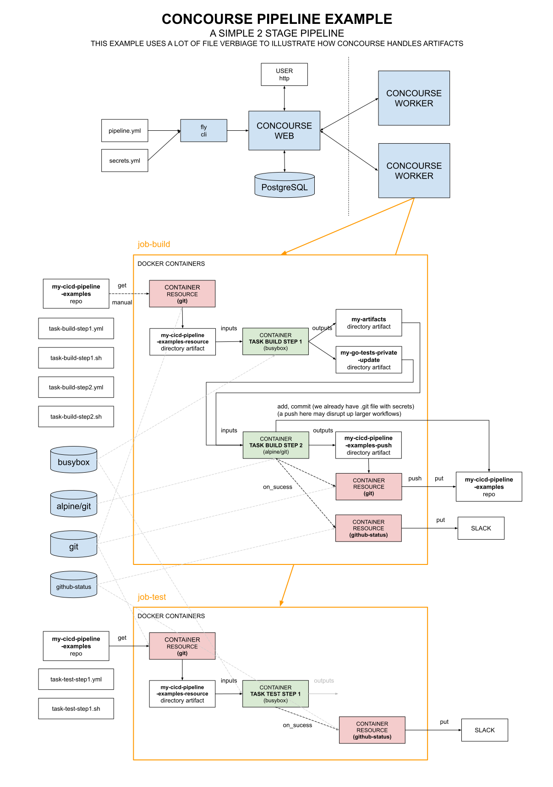

# CONCOURSE PIPELINE EXAMPLE

[](https://jeffdecola.mit-license.org)
[](https://jeffdecola.com)

  _A concourse pipeline example that show task steps and how
  concourse handles artifacts. It uses a github repo and separates
  the task steps and script files.
  This should be your goto example to understand concourse._

Table of Contents

* [OVERVIEW](https://github.com/JeffDeCola/my-cicd-pipeline-examples/tree/master/concourse-pipelines/concourse-pipeline-example#overview)
* [PIPELINE](https://github.com/JeffDeCola/my-cicd-pipeline-examples/tree/master/concourse-pipelines/concourse-pipeline-example#pipeline)
* [JOB BUILD](https://github.com/JeffDeCola/my-cicd-pipeline-examples/tree/master/concourse-pipelines/concourse-pipeline-example#job-build)
* [JOB TEST](https://github.com/JeffDeCola/my-cicd-pipeline-examples/tree/master/concourse-pipelines/concourse-pipeline-example#job-test)

## OVERVIEW

This pipeline outlines the feature of the concourse ci system.
It will build a todays-date.txt file and then test if it is there.



## PIPELINE

To add the pipeline to concourse I used,

```bash
fly --target jeffs-ci-target \
    set-pipeline \
    --pipeline concourse-pipeline-example \
    --config pipeline.yml \
    --load-vars-from ../../../../.concourse-secrets.yml \
    --check-creds
```

My .concourse-secrets files has the following,

```yml
slack_poo_concourse_webhook_url_token: https://hooks.slack.com/services/{my-token}
repo_github_token: {my-token}
dockerhub_token: {my-token}
concourse_git_private_key: {my-key}
```

## JOB BUILD

```yaml
- name: job-build
  plan:

  # GET REPO FROM GITHUB (MANUALLY)
  - get: my-cicd-pipeline-examples-resource
    trigger: false

  # STEP 1
  - task: task-build-step1
    file: my-cicd-pipeline-examples-resource/concourse-pipelines/concourse-pipeline-example/jobs/build/task-build-step1.yml

  # STEP 2
  - task: task-build-step2
    file: my-cicd-pipeline-examples-update/concourse-pipelines/concourse-pipeline-example/jobs/build/task-build-step2.yml

    # TASK SUCCESS
    on_success:
      do:
        # PUSH NEW REPO TO GITHUB (add and commit done in shell script)
        - put: my-cicd-pipeline-examples-push
          params:
            repository: my-cicd-pipeline-examples-push
        # SEND SLACK ALERT
        - put: resource-slack-alert
          params:
            channel: '#ci-concourse'
            text: "From my-cicd-pipeline-examples: PASSED job-build in concourse ci."

    # TASK FAILURE
    on_failure:
      do:
        # SEND SLACK ALERT
        - put: resource-slack-alert
          params:
            channel: '#ci-concourse'
            text: "From my-cicd-pipeline-examples: FAILED job-build in concourse ci."
```

## JOB TEST

```yaml
- name: job-test
  plan:

  # WAIT FOR JOB-BUILD TO FINISH
  - get: my-cicd-pipeline-examples-resource
    passed: [job-build]
    trigger: true

  # STEP 1
  - task: task-test-step1
    file: my-cicd-pipeline-examples-resource/concourse-pipelines/concourse-pipeline-example/jobs/test/task-test-step1.yml

    # TASK SUCCESS
    on_success:
      do:
        # SEND SLACK ALERT
        - put: resource-slack-alert
          params:
            channel: '#ci-concourse'
            text: "From my-cicd-pipeline-examples: PASSED job-test in concourse ci."

    # TASK FAILURE
    on_failure:
      do:
        # SEND SLACK ALERT
        - put: resource-slack-alert
          params:
            channel: '#ci-concourse'
            text: "From my-cicd-pipeline-examples: FAILED job-test in concourse ci."
```
