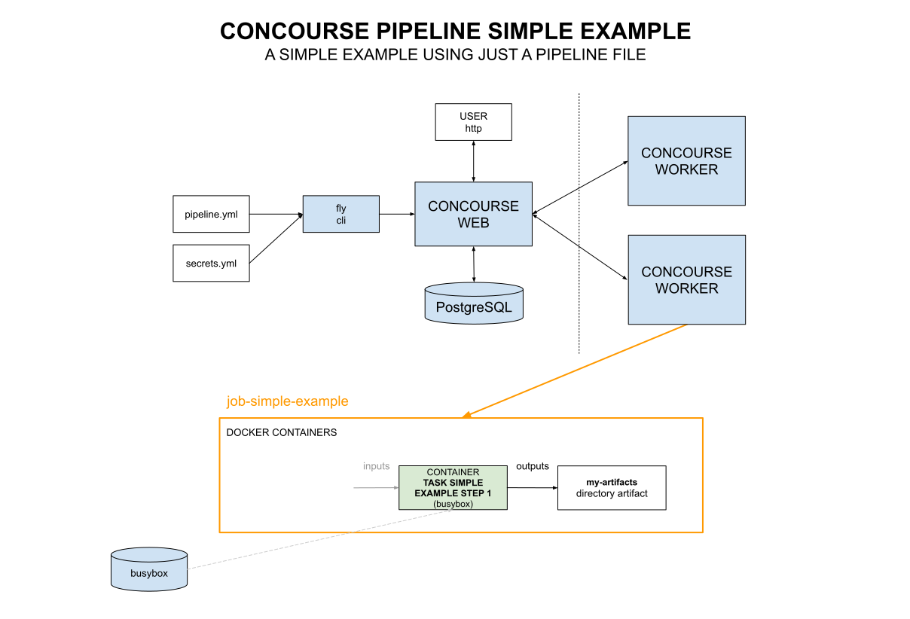

# CONCOURSE PIPELINE SIMPLE EXAMPLE

[](https://jeffdecola.mit-license.org)
[](https://jeffdecola.com)

  _A simple concourse pipeline using just a pipeline.yml file._

Table of Contents

* [OVERVIEW](https://github.com/JeffDeCola/my-cicd-pipeline-examples/tree/master/concourse-pipelines/concourse-pipeline-simple-example#overview)
* [PIPELINE](https://github.com/JeffDeCola/my-cicd-pipeline-examples/tree/master/concourse-pipelines/concourse-pipeline-simple-example#pipeline)
* [JOB SIMPLE EXAMPLE](https://github.com/JeffDeCola/my-cicd-pipeline-examples/tree/master/concourse-pipelines/concourse-pipeline-simple-example#job-simple-example)

## OVERVIEW

This pipeline is very basic.



## PIPELINE

To add the pipeline to concourse I used,

```bash
fly --target jeffs-ci-target \
    set-pipeline \
    --pipeline concourse-pipeline-simple-example \
    --config pipeline.yml \
    --load-vars-from ../../../../.concourse-secrets.yml \
    --check-creds
```

My .concourse-secrets files has the following,

```yml
slack_poo_concourse_webhook_url_token: https://hooks.slack.com/services/{my-token}
repo_github_token: {my-token}
dockerhub_token: {my-token}
concourse_git_private_key: {my-key}
```

## JOB SIMPLE EXAMPLE

Job build has 1 task step. It is kicked off manually.

* Task Simple Example Step 1
  * **DOCKER IMAGE:** busybox
  * **INPUTS:** N/A
  * **OUTPUTS:** my-artifacts
  * **RUN:**
    * Print a welcome message
    * list the current directory
    * Create a todays-date.txt file and place in my-artifacts
    * cat todays-date.txt

The output will look like the following,

```bash
+ echo 'WELCOME TO TASK SIMPLE EXAMPLE STEP 1'
WELCOME TO TASK SIMPLE EXAMPLE STEP 1
+ echo ' '
 
+ pwd
/tmp/build/33b65172
+ ls -lat .
total 12
drwxr-xr-x    3 root     root          4096 Feb  3 07:48 .
drwxr-xr-x    3 root     root          4096 Feb  3 07:48 ..
drwxr-xr-x    2 root     root          4096 Feb  3 07:48 my-artifacts
+ echo ' '
 
+ echo 'CREATE DATE AND TIME FILE my-artifacts/todays-date.txt'
CREATE DATE AND TIME FILE my-artifacts/todays-date.txt
+ printf 'Hello from Task Simple Example Step 1\n'
+ date '+%a, %b %d, %Y - %I:%M%p'
+ cat my-artifacts/todays-date.txt
Hello from Task Simple Example Step 1
Mon, Feb 03, 2025 - 07:48AM
+ echo ' '
```

```yaml
jobs:

#------------------------------------------------------------------------------------------
- name: job-simple-example
  plan:

  # STEP 1
  - task: task-simple-example-step1
    config:
      platform: linux
      image_resource:
        type: registry-image
        source:
          repository: busybox
      # inputs:
      #  - name:
      outputs:
        - name: my-artifacts
      run:
        # This is a neat way of embedding a script into a task
        path: sh
        args:
        - -cx
        - |
          echo "WELCOME TO TASK SIMPLE EXAMPLE STEP 1"
          echo " "

          pwd
          ls -lat .
          echo " "

          echo "CREATE DATE AND TIME FILE my-artifacts/todays-date.txt"
          printf "Hello from Task Simple Example Step 1\n" >> my-artifacts/todays-date.txt
          date "+%a, %b %d, %Y - %I:%M%p" >> my-artifacts/todays-date.txt
          cat my-artifacts/todays-date.txt
          echo " "
```
