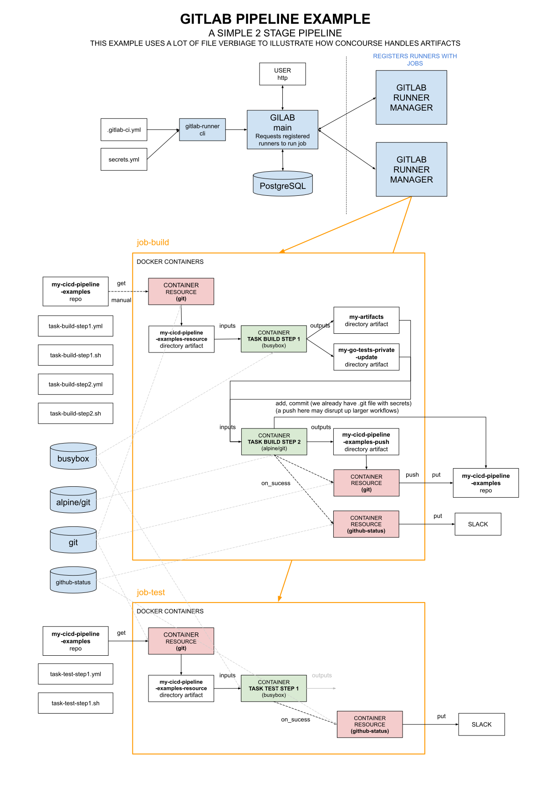

# GITLAB PIPELINE EXAMPLE

  _A gitlab pipeline example that show task steps and how
  gitlab handles artifacts. It uses a github repo and separates
  the task steps and script files.
  This should be your goto example to understand gitlab._

Table of Contents

* [OVERVIEW](https://github.com/JeffDeCola/my-cicd-pipeline-examples/tree/master/gitlab-pipelines/gitlab-pipeline-example#overview)
* [PIPELINE](https://github.com/JeffDeCola/my-cicd-pipeline-examples/tree/master/gitlab-pipelines/gitlab-pipeline-example#pipeline)
* [JOB BUILD](https://github.com/JeffDeCola/my-cicd-pipeline-examples/tree/master/gitlab-pipelines/gitlab-pipeline-example#job-build)
* [JOB TEST](https://github.com/JeffDeCola/my-cicd-pipeline-examples/tree/master/gitlab-pipelines/gitlab-pipeline-example#job-test)

## OVERVIEW

This pipeline will outlines the main features of the gitlab ci/cd system.
It will build a todays-date.txt file and then test if its there.

## PIPELINE

To add the pipeline to gitlab I used,

## JOB BUILD

## JOB TEST
