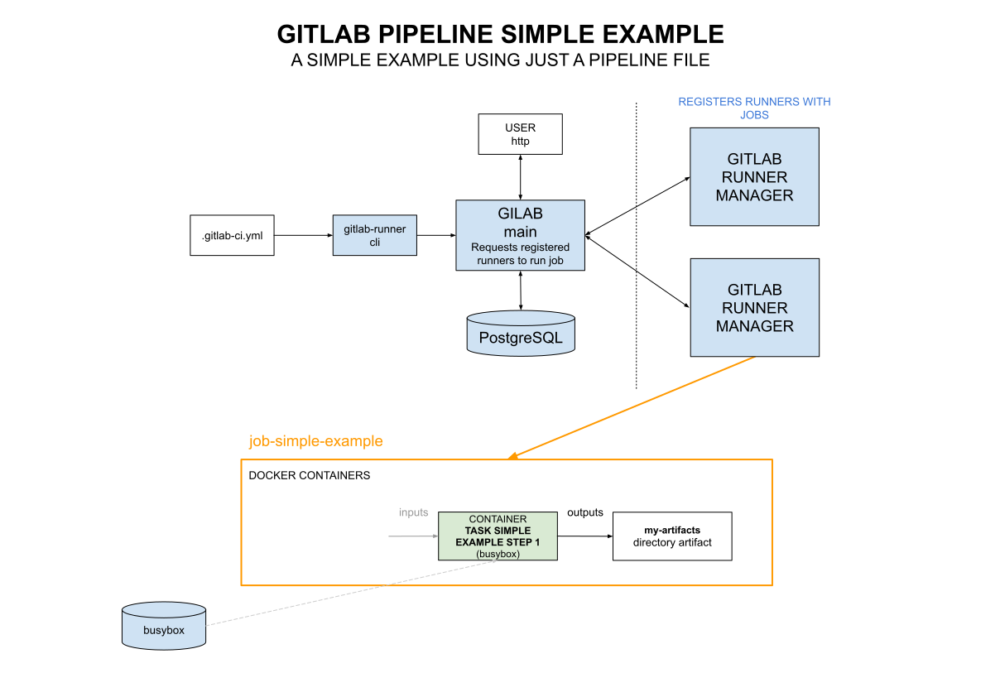

# GITLAB PIPELINE SIMPLE EXAMPLE

[](https://jeffdecola.com)
[](https://jeffdecola.mit-license.org)

```text
*** UNDER CONSTRUCTION - CHECK BACK SOON ***
```

_A simple gitlab pipeline using just a .gitlab.yml file._

Table of Contents

* [OVERVIEW](https://github.com/JeffDeCola/my-cicd-pipeline-examples/tree/master/gitlab-pipelines/gitlab-pipeline-simple-example#overview)
* [PIPELINE](https://github.com/JeffDeCola/my-cicd-pipeline-examples/tree/master/gitlab-pipelines/gitlab-pipeline-simple-example#pipeline)
* [JOB SIMPLE EXAMPLE](https://github.com/JeffDeCola/my-cicd-pipeline-examples/tree/master/gitlab-pipelines/gitlab-pipeline-simple-example#job-simple-example)

## OVERVIEW

This pipeline is very basic.



## PIPELINE

tbd

## JOB SIMPLE EXAMPLE

tbd
